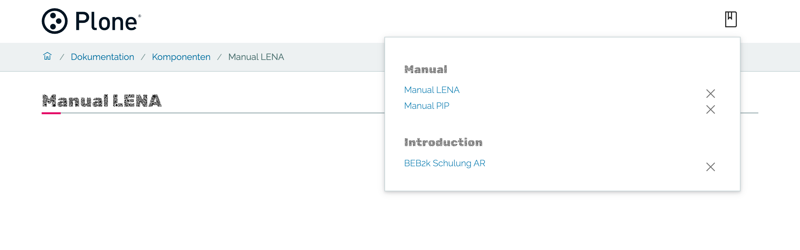

# volto-bookmarks


[Plone (Volto)](https://github.com/plone/volto) add-on

## Features

Add and manage bookmarks of pages and searchkit queries.

Bookmarks are grouped by the value of a selectable content type field.




## Getting started

There are two options:

- Buttons in toolbar
- Buttons somewhere else

## Installation

- Provide the necessary REST API endpoints for your Plone backend by installing [collective.bookmarks](https://github.com/collective/collective.bookmarks.git) 

- Remember to install souper in Plone backend control panel.

- Install this Plone (Volto) add-on `@plone-collective/volto-bookmarks`. See [Volto docs](https://6.docs.plone.org/volto/addons/index.html#configuring-a-volto-project-to-use-an-add-on) for instructions.


## Integration of the two bookmark buttons

### Option 1 - buttons in toolbar

> This requires Volto >= 16.10.0 with a pluggable toolbar.

Include bookmarking in your Volto project by integrating a component `Bookmarking`.
This component adds two buttons to the toolbar: one for toggling the bookmark of the current page and one for displaying a menu with a list of bookmarks.

`config.js`:

```js
import { Bookmarking } from '@plone-collective/volto-bookmarks/components';

import '@plone/volto/config';

export default function applyConfig(config) {
  config.settings.appExtras = [
    ...config.settings.appExtras,
    {
      match: '/',
      component: Bookmarking,
    },
  ];
  return config;
}
```


### Option 2 - buttons not in toolbar, but somewhere else

Add the two buttons to components of your choice:

```jsx
import { ShowBookmarksContentButton } from '@plone-collective/volto-bookmarks/components';

    <ShowBookmarksContentButton />

```

```jsx
import { ToggleBookmarkButton } from '@plone-collective/volto-bookmarks/components';

    <ToggleBookmarkButton />

```


### Further configuration for both options

Add a mapping for bookmark groups labels and the name of the field for grouping bookmarks list.

```js
config.settings.bookmarks = {
  ...config.settings.bookmarks,
  bookmarkgroupmapping: {
    manual: 'Manuals and HowTos',
    releasenote: 'Release Notes',
    default_search: 'Search',
    default_nogroup: 'Miscellaneous',
  },
  bookmarkgroupfield: '@type',
};
```

Add a mapping for search filters:

```js
    config.settings.bookmarks.filtermapping = {
      facet_fields: {
        '5237dc43-c573-4651-a5b8-cf24bfde13a6': 'Datendrehscheibe',
        allgemeines: 'Allgemeines',
        arbeitsliste: 'Arbeitsliste',
        beb2k: 'BEB2k',
        'release-note': 'Release-Note',
        tutorial: 'Tutorial',
        'superuser-innen': 'Superuser/innen',
        ai: 'AI',
        andere: 'Andere',
        tg: 'TG',
        zh: 'ZH',
      },
      search_sections: {
        others: 'Website',
        dokumentation: 'Dokumentation',
        inside: 'IGIB-Inside',
        geologie: 'Geologie',
      },
    },
```


## Copyright and License

Author Katja Süss, Rohberg, @ksuess
https://www.rohberg.ch

Copyright (c) 2023 Plone Foundation

See [LICENSE.md](https://github.com/collective/volto-bookmarks/blob/master/LICENSE.md) for details.
