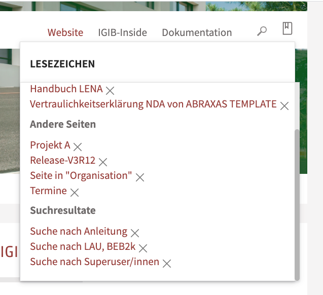

# volto-bookmarks


[Volto](https://github.com/plone/volto) add-on

## Features

Add and manage bookmarks: pages and pages with params like faceted navigation links to filtered content.

Bookmarks are grouped by the value of a selectable content type field.




## Getting started

There are two options:

- Buttons in toolbar
- Buttons somewhere else

> This add-on requires Volto 12.

> And this add-on requires upcoming Volto 12.xy or higher version with a pluggable toolbar if you want to place the buttons in toolbar.

Provide the necessary REST API endpoints for your Plone backend by installing [collective.bookmarks](https://github.com/collective/collective.bookmarks.git) ( by now branch ksuess-2021)

Remember to install souper in control panel.


### Option 1 - buttons in toolbar

Include bookmarking of this package in your Volto projects config.js by

```js
import { ToggleBookmarkButton, ShowBookmarksToolbarButton } from '@collective/volto-bookmarks/components';

export default function applyConfig(config) {
  config.toolbar.activities.view.top.push({
    match: {
      path: '/pathtosectionofbookmarkablepages/',
    },
    component: ToggleBookmarkButton,
  });
  config.toolbar.activities.view.bottom.push({
    match: {
      path: '/',
    },
    component: (props) => <ShowBookmarksToolbarButton {...props} />,
  });

  return config;
}
```

It adds two buttons in toolbar: one for toggling the bookmark of the current page and one for displaying a menu with a list of bookmarks.

### Option 2 - buttons not in toolbar but sowhere else


```jsx
import { ShowBookmarksContentButton } from '@collective/volto-bookmarks/components';

    <ShowBookmarksContentButton token={this.props.token} />

```

```jsx
import { ToggleBookmarkButton } from '@collective/volto-bookmarks/components';

    <ToggleBookmarkButton token={token} />

```

### Further configuration for both options

Add a mapping for bookmark groups labels and the name of the field for grouping bookmarks list.

```js
// @collective/volto-bookmarks
export const BOOKMARKGROUPMAPPING = {
  Anleitung: 'Anleitungen',
  Übersichtsseite: 'Übersichtsseiten',
  ReleaseNote: 'Release Notes',
  default_search: 'Search',
  default_nogroup: 'Miscellaneous',
};

export const BOOKMARKGROUPFIELD = 'informationtype';
````

## Copyright and license

Author Katja Süss, Rohberg, 
https://www.rohberg.ch

Copyright (c) 2021 Plone Foundation

See [LICENSE.md](https://github.com/collective/volto-bookmarks/blob/master/LICENSE.md) for details.
